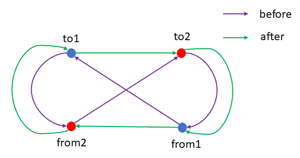

# [main.cpp](./main.cpp)の説明

## 実行方法

```
g++ main.cpp
a.exe num
```

`num`は`input.csv`の番号で、`input_${num}.csv`を読み込んでtspを解き、結果を`output_${num}.csv`に出力する。(`num`は0~6の範囲の数字である必要がある。)

https://rozelin-dc.github.io/google-step-tsp/visualizer/build/default/で結果を確認できる。

## プログラムの説明

### `main`関数内の変数と全体で使う構造体

#### `coordinate_t`

座標を表す構造体。`index`が座標のインデックス、`x`, `y`が座標のx座標、y座標を表す。

#### `targetDataNum`

実行時引数として受け取った`num`を保存する変数。

#### `data`

`input_${targetDataNum}.csv`にある全ての座標データを、インデックスをキー、座標の情報(`coordinate_t`)が値の形で持つハッシュテーブル。

#### `path`

訪れる座標のインデックスを訪れる順に保存し、最終的に中身を`output_${targetDataNum}.csv`に出力するための配列。

### その他関数

#### `calculateDistance`

引数として座標を2つ受け取り、その2点間の距離の二乗を計算する関数。二乗にしたのは、少しでも誤差を少なくするためである。

#### `greedySearch`

`data`と`path`を引数として受け取り、貪欲法で経路を検索する関数。`path`には最初に訪れる座標のインデックスのみ保存されている必要がある。

貪欲法では`data`が全探索されるので、実行時間を短くするため、既に`path`に保存されている座標については`data`から削除するようにした。

#### `doTwoOpt`

`data`と`path`を引数として受け取り、2-optを行う関数。`path`には全ての座標のインデックスが保存されている必要がある。

2つのパスがクロスしていた場合、下の図のようにパスを組み替える。



#### `swapFivePoint`

#### `nearLineSegmentPointPathChange`

#### `isPathCrossing`

座標データ`from1`, `to1`, `from2`, `to2`を引数として受け取り、`from1`と`to1`を結ぶ線分と`from2`と`to2`を結ぶ線分が交差しているかどうかを返す関数。交差していたら`true`を返す。

#### `isPointAndLineSegmentEnoughNear`

#### `readInput`

`data`と`targetDataNum`を引数として受け取り、`input_${targetDataNum}.csv`にある座標データを読み込んで`data`に保存する関数。

#### `outputCsv`

`path`と`targetDataNum`を引数として受け取り、`path`の中身を`output_${targetDataNum}.csv`に出力する関数。

